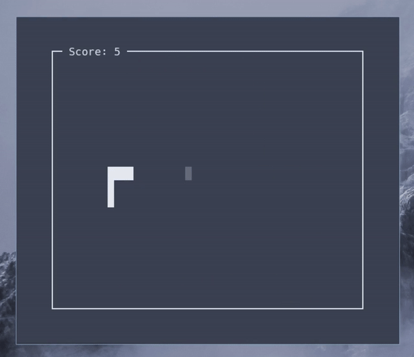

# Snake Game in Python

Things that I learned in this project:

- OOP in Python.
- Clean code.
- The `curses` library.


## How to run the game

You need to clone this project and run the `run.py` file, in `src/` folder, with the python interpreter.

```bash
git clone https://github.com/kevinmarquesp/snake_game
cd snake_game/src
./run.py # OR: python3 run.py
```


### About the game

You can move the snake with **arrow keys**, **vim keys** (*H*, *J*, *K*, *L*) and *WASD*. **Space**, **Return** and **O** keys do the same thing, they are the *confirm* key.



